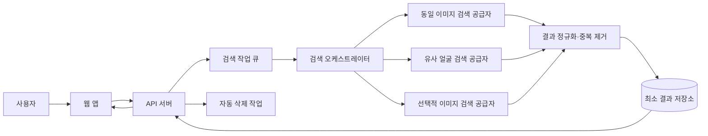
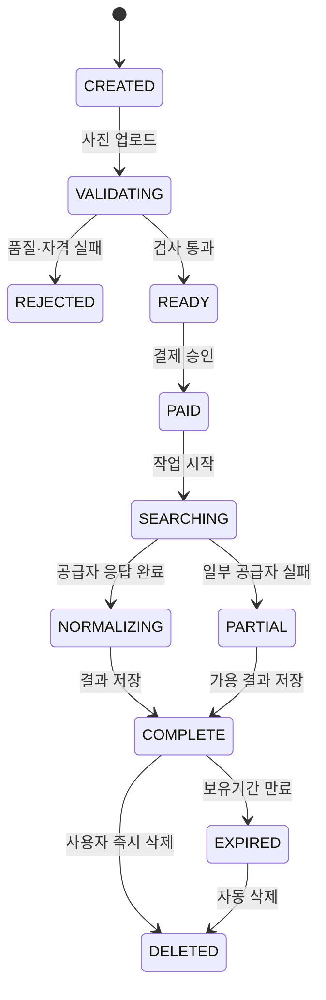

# 온라인 사진 셀프검색 MVP 설계

문서 버전: 0.1

작성일: 2026년 8월 24일

연결 문서: `개인_온라인_사진_셀프검색_서비스_기획서_v0.3.md`

## 1. 설계 목표

성인 사용자가 본인 사진 한 장을 등록하고 소액을 결제하면, 별도의 사람 검수 없이 공개 인터넷의 동일·유사 이미지 후보를 자동으로 확인할 수 있는 웹 MVP를 구현한다.

### 최우선 목표

- 3분 이내에 이해하고 사용할 수 있는 흐름
- 대부분의 검색을 수분 내 자동 완료
- 공급자 교체가 가능한 구조
- 검색 1건당 원가 상한 관리
- 얼굴사진과 특징값의 짧은 보유 및 자동 삭제
- 사용자가 후보의 동일인 여부를 직접 판단

### 비목표

- 인터넷 전체 커버리지
- 동일인 자동 확정
- 자체 얼굴검색 인덱스
- 삭제·신고·법률 대응
- 정기 모니터링
- 운영자 결과 검수

## 2. MVP 형태

- 반응형 웹 애플리케이션
- 한국어 우선
- 일회성 검색권
- 비공개 베타부터 시작
- 모바일 브라우저를 기본 사용환경으로 설계

## 3. 전체 구조



검색 공급자는 공통 인터페이스 뒤에 둔다.

```text
SearchProvider
├─ checkAvailability()
├─ estimateCost(request)
├─ submitSearch(image, options)
├─ pollSearch(jobId)
├─ normalizeResults(rawResults)
└─ deleteProviderData(jobId)
```

초기 구현 후보는 다음과 같다.

- `WebMatchProvider`: Google Vision Web Detection 등 동일·부분일치 이미지 검색
- `FaceSearchProvider`: FaceCheck.ID 또는 이용 가능한 얼굴검색 API
- `TextImageProvider`: 이름·닉네임을 입력받는 경우에만 사용

## 4. 권장 기술 구성

과도한 분산 시스템 없이 하나의 웹 프로젝트와 관리형 서비스를 이용한다.

| 영역 | 권장안 | 이유 |
|---|---|---|
| 웹·서버 | Next.js + TypeScript | 화면과 API를 하나의 코드베이스에서 구현 |
| 데이터베이스 | PostgreSQL | 결제·검색 작업·결과 메타데이터 관리 |
| 임시 파일 | 비공개 객체 저장소 | 만료 규칙과 암호화 적용 |
| 작업 처리 | 관리형 큐 또는 PostgreSQL 기반 작업 큐 | 외부 검색의 비동기 응답 처리 |
| 결제 | 국내 PG의 간편결제 | 소액 원화 결제와 환불 처리 |
| 오류 추적 | 민감정보 필터를 적용한 오류 추적 도구 | 사진·URL·특징값 수집 금지 |
| 배포 | 국내 또는 개인정보 요구사항을 충족하는 관리형 환경 | 초기 운영 부담 최소화 |

얼굴 재비교가 필요할 때만 서울 리전의 상용 얼굴 비교 API를 선택적으로 사용한다. 자체 GPU와 벡터 데이터베이스는 사용하지 않는다.

## 5. 주요 화면

### S1. 랜딩

- 한 문장 가치 제안
- 검색 가능한 영역과 불가능한 영역
- 예상 가격과 소요시간
- `내 사진 검색하기` 버튼
- 본인 사진만 가능하다는 고지

### S2. 동의·자격 확인

- 만 19세 이상 확인
- 본인 사진이라는 확인
- 얼굴정보 처리 동의
- 외부 공급자 제공·국외이전 고지 및 동의
- 결과가 동일인을 확정하지 않는다는 확인

### S3. 사진 등록

- 사진 1장 업로드
- 좋은 사진 예시
- 얼굴 품질 자동 검사
- 실패 사유와 재등록 안내
- 비공개 베타에서는 초대코드 확인

### S4. 주문 확인

- 적용될 검색 범위
- 총 결제액
- 결과가 없을 수 있다는 안내
- 사진과 결과의 삭제 시점
- 결제 버튼

### S5. 검색 진행

- 업로드 완료
- 동일 이미지 검색 중
- 유사 얼굴 후보 검색 중
- 중복 결과 정리 중
- 예상 대기시간
- 페이지를 닫아도 확인 가능한 검색번호 또는 이메일 링크

### S6. 결과

- 전체 고유 후보 수
- `동일 이미지`, `매우 유사한 후보`, `확인해 볼 후보` 탭
- 흐림 처리된 썸네일과 사용자가 눌러 확인하는 방식
- 출처 도메인과 원문 링크
- `나와 같음 / 아님` 버튼
- 검색한 범위와 검색하지 못한 범위
- 결과 없음 전용 설명

### S7. 완료·삭제

- 기준사진 삭제 완료 여부
- 결과 기록 즉시 삭제 버튼
- 만족도와 궁금증 해소 여부
- 다시 검색하고 싶은 시점
- 원하는 후속 기능 선택

## 6. 검색 작업 흐름



### 처리 순서

1. 업로드 시 파일 형식, 크기와 악성 파일 여부를 검사한다.
2. 한 명의 성인 얼굴로 보이는지와 검색 적합 품질을 확인한다.
3. 임시 저장소에 무작위 경로로 암호화 저장한다.
4. 결제 성공 후 검색 작업을 생성한다.
5. 동일 이미지와 유사 얼굴 공급자를 병렬 호출한다.
6. 공급자별 타임아웃과 최대 재시도 횟수를 적용한다.
7. 응답을 공통 결과 형식으로 정규화한다.
8. URL, 이미지 해시와 출처 기준으로 중복을 제거한다.
9. 자동 등급을 부여하고 임계값 미만 후보를 제외한다.
10. 결과를 표시하고 사용자 판정을 받는다.
11. 기준사진과 임시 특징값을 삭제한다.
12. 설정된 결과 보유기간 후 URL·썸네일 메타데이터도 삭제한다.

## 7. 결과 정규화

모든 공급자 결과를 다음 공통 형식으로 변환한다.

```ts
type SearchCandidate = {
  id: string;
  jobId: string;
  provider: string;
  matchType: "exact" | "partial" | "face" | "text_assisted";
  sourceUrl: string;
  sourceDomain: string;
  thumbnailUrl?: string;
  providerScore?: number;
  normalizedTier: "strong" | "review" | "hidden";
  imageHash?: string;
  discoveredAt: string;
  userVerdict?: "self" | "not_self";
};
```

### 자동 등급 원칙

- `exact`: 동일 또는 강한 변형 이미지로 표시
- `face + strong`: 얼굴이 매우 유사한 후보로 표시
- `face + review`: 확인해 볼 후보로 표시
- `hidden`: 기본 결과 수와 화면에서 제외하고 내부 품질 통계에만 반영

공급자별 점수의 의미가 다르므로 하나의 공통 확률로 변환하지 않는다. 공급자별 벤치마크를 통해 표시 등급에 필요한 개별 임계값을 설정한다.

## 8. 중복 제거

다음 순서로 중복을 묶는다.

1. 추적 파라미터를 제거한 정규화 URL 비교
2. 동일한 출처 페이지 비교
3. 이미지 파일 해시 비교
4. 지각 해시 거리를 이용한 크롭·압축·자막 변형 묶기
5. 동일 출처의 중복 결과에서는 대표 후보 하나를 먼저 표시

원문 이미지를 장기간 내려받아 저장하지 않는다. 중복 판별이 필요한 경우 작업 중 임시 저장하고 즉시 삭제한다.

## 9. 비용 제어

검색을 시작하기 전에 작업별 최대 예상원가를 계산한다.

```text
예상원가 = 공급자 기본 호출비
         + 후보 재비교 상한
         + 결제수수료
         + 변동 저장·전송 비용
         + 실패·환불 충당액
```

### 제어 규칙

- 결제 전 무료 얼굴검색 API 호출 금지
- 사용자당 공급자 호출 횟수 상한
- 재시도는 공급자당 최대 1회
- 타임아웃 공급자를 무한 대기하지 않고 부분 결과 제공
- 추가 얼굴 비교는 상위 후보 일부에만 적용
- 썸네일 프록시와 이미지 다운로드 횟수 제한
- 동일 사용자의 단시간 반복 검색 제한
- 공급자 일일 비용 한도와 자동 차단

### 가격 결정 전 측정값

- 공급자별 성공 호출 원가
- 실패·재시도 포함 실제 검색 1건 원가
- 평균 후보 수와 썸네일 전송비
- 결제수수료와 환불률
- 990원·1,900원·2,900원에서의 기여이익

## 10. 데이터 모델

최소 테이블만 둔다.

### users

- `id`
- `email_hash` 또는 인증 공급자 식별자
- `adult_confirmed_at`
- `created_at`
- `blocked_at`

### search_jobs

- `id`
- `user_id`
- `status`
- `product_code`
- `provider_plan`
- `estimated_cost`
- `actual_cost`
- `photo_delete_at`
- `result_delete_at`
- `created_at`, `completed_at`, `deleted_at`

### provider_runs

- `id`
- `search_job_id`
- `provider`
- `external_job_token`의 암호화 값
- `status`
- `cost`
- `result_count`
- `latency_ms`
- `error_code`

### search_candidates

- 공통 후보 형식의 최소 메타데이터
- 원본 얼굴 특징값 저장 금지

### payments

- `id`, `user_id`, `search_job_id`
- PG 거래 식별자
- 금액, 상태, 환불 상태
- 카드번호 등 결제 원문 저장 금지

### feedback

- 검색 작업 단위 만족도
- 궁금증 해소 여부
- 몰랐던 결과 발견 여부
- 후속 기능 관심도

### audit_events

- 로그인, 결제, 검색 실행, 삭제, 차단 이벤트
- 사진 내용이나 얼굴 특징값 기록 금지

## 11. API 초안

```text
POST   /api/uploads/presign
POST   /api/photos/validate
POST   /api/search-jobs
POST   /api/payments/prepare
POST   /api/payments/confirm
POST   /api/search-jobs/:id/start
GET    /api/search-jobs/:id
GET    /api/search-jobs/:id/results
POST   /api/results/:id/verdict
POST   /api/search-jobs/:id/feedback
DELETE /api/search-jobs/:id
POST   /api/webhooks/payment
```

모든 검색·결과 API는 작업 소유권을 확인한다. 외부 공급자 토큰과 원본 응답을 브라우저에 노출하지 않는다.

## 12. 개인정보와 보안 요구사항

### 필수

- 업로드와 API 통신 전 구간 TLS
- 비공개 객체 저장소와 서버 측 암호화
- 무작위 파일명과 서명된 단기 URL
- 업로드 파일 유형·크기·픽셀 수 제한
- 애플리케이션 서버 외의 원본 접근 차단
- 관리자 화면에서 원본사진 기본 열람 불가
- 공급자 키를 비밀관리 서비스에 보관
- 민감정보가 제거된 구조화 로그
- 사진·특징값·공급자 요청 본문을 오류 추적 도구로 전송 금지
- 검색 작업과 저장 객체의 만료·삭제 작업
- 삭제 실패 재시도와 삭제 상태 기록
- 계정·기기·결제수단 기준 속도 제한
- 결과 페이지 검색엔진 색인 차단
- 결과 URL에 추측 가능한 식별자 사용 금지

### 보유기간 초안

| 데이터 | 기본 보유안 |
|---|---|
| 기준사진 | 검색 완료 후 즉시 또는 최대 24시간 내 삭제 |
| 임시 얼굴 특징값 | 작업 완료 즉시 삭제 |
| 외부 공급자 작업 식별자 | 삭제 확인 또는 장애 대응 후 삭제 |
| 결과 URL·썸네일 메타데이터 | 7일 이내 또는 사용자 즉시 삭제 |
| 결제 기록 | 관계 법령과 회계상 필요한 기간 |
| 익명화된 성능 통계 | 개인과 재결합할 수 없는 형태로 제한 보관 |

실제 보유기간은 공급자 정책, 국내 법률 검토와 사용자 경험을 반영해 출시 전에 확정한다.

## 13. 오류와 환불 처리

| 상황 | 사용자 처리 |
|---|---|
| 사진 품질 실패 | 결제 전에 재등록 안내 |
| 결제 실패 | 검색 작업 시작 금지 |
| 일부 공급자 실패 | 이용 가능한 결과와 실패한 검색 범위 표시, 상품 기준에 따라 자동 부분환불 |
| 모든 공급자 실패 | 자동 전액환불 또는 검색권 복구 |
| 결과 0건 | 정상 검색 완료로 처리하되 사전 안내와 범위 표시 |
| 원문 링크 만료 | 링크 확인일 표시, 서비스가 원문을 보장하지 않음을 안내 |
| 삭제 작업 실패 | 자동 재시도 후 운영 알림, 사용자에게 완료 전 상태 표시 |

## 14. 분석 이벤트

얼굴 이미지와 원문 URL을 분석 도구에 보내지 않는다.

```text
landing_viewed
search_started
consent_completed
photo_validation_succeeded
photo_validation_failed
checkout_started
payment_succeeded
provider_search_succeeded
provider_search_failed
search_completed
results_viewed
candidate_marked_self
candidate_marked_not_self
feedback_submitted
data_delete_requested
data_delete_completed
```

필수 속성은 상품코드, 공급자 조합, 결과 개수 구간, 처리시간 구간과 비용 구간으로 제한한다.

## 15. MVP 대시보드

주 단위로 다음 지표를 확인한다.

- 방문자, 사진 등록자, 결제자, 검색 완료자
- 단계별 전환율
- 검색 완료시간 중앙값과 95백분위
- 공급자별 성공률·응답시간·실제 원가
- 사용자 판정 기준 후보 일치율
- 유효 결과를 1건 이상 발견한 사용자 비율
- 궁금증 해소 긍정률
- 환불률과 지원 문의율
- 데이터 삭제 성공률
- 검색 횟수 제한·악용 의심 차단 수

## 16. 테스트 전략

### 기능 테스트

- 정상 사진, 얼굴 없음, 다중 얼굴, 저해상도, 손상 파일
- 결제 성공·실패·중복 웹훅
- 공급자 성공·부분 실패·타임아웃
- 중복 URL·동일 이미지·변형 이미지 묶기
- 결과 없음과 원문 링크 만료
- 사용자 즉시 삭제와 자동 만료 삭제

### 품질 테스트

- 명시적 동의를 받은 한국 성인 테스트셋
- 동일 사진, 크롭, 압축, 반전, 워터마크 변형
- 동일인의 다른 시점·각도·조명 사진
- 닮은 타인과 오탐 사례
- 국내 뉴스·블로그·커뮤니티 등 출처군별 알려진 공개 사례

### 보안·개인정보 테스트

- 다른 사용자의 작업 ID 접근 차단
- 서명 URL 만료와 객체 저장소 비공개 확인
- 로그·오류 추적에 민감정보가 남지 않는지 확인
- 업로드 파일 위장과 과대 이미지 차단
- 검색 속도 제한과 여러 얼굴 반복 검색 차단
- 데이터베이스, 객체 저장소와 공급자 측 삭제 확인

## 17. 출시 승인 기준

비공개 베타 시작 전 다음 조건을 충족한다.

- 공급자 2개 이상의 실제 연동 또는 주 공급자와 장애 대체 경로 확보
- 동의 테스트셋에서 임계값과 오탐 범위 기록
- 검색 1건당 최대 원가가 판매가 이내로 제한
- 모든 공급자 실패 시 자동 검색권 복구 또는 환불
- 사진·특징값 자동 삭제 테스트 통과
- 다른 사용자 결과에 대한 접근통제 테스트 통과
- 약관, 개인정보 처리, 생체정보와 국외이전 관련 검토 완료
- 미성년자·타인 검색 금지와 검색 횟수 제한 적용
- 결과 없음과 검색 한계 문구 적용
- 장애·삭제 실패 알림 적용

## 18. 개발 순서

### 스프린트 0: 공급자 검증

- API 계약·지역·가격·보유정책 확인
- 한국 사용자 테스트셋 비교
- 공통 결과 형식과 비용표 작성

### 스프린트 1: 검색 코어

- 사진 업로드와 품질 검사
- 공급자 어댑터
- 검색 작업 상태와 비동기 처리
- 결과 정규화·중복 제거

### 스프린트 2: 사용자 제품

- 동의, 결제, 진행 화면
- 결과 목록과 사용자 판정
- 결과 없음 화면
- 만족도·후속 기능 설문

### 스프린트 3: 안전·운영

- 자동 삭제와 삭제 증적
- 속도·비용 제한
- 오류·환불 처리
- 핵심 지표 대시보드
- 비공개 베타 배포

## 19. 비공개 베타의 최종 질문

MVP는 다음 질문에 답하면 목적을 달성한다.

1. 사용자는 이 검색을 실제로 결제하고 실행하는가?
2. 자동 결과만으로 궁금증이 해소되는가?
3. 대한민국 사용자에게 의미 있는 본인 결과가 발견되는가?
4. 오탐과 검색 한계를 사용자가 받아들일 수 있는가?
5. 낮은 가격에서도 검색 1건당 기여이익을 만들 수 있는가?
6. 사용자가 가장 원하는 다음 기능은 재검색, 검색범위 확대, 삭제 지원 중 무엇인가?
